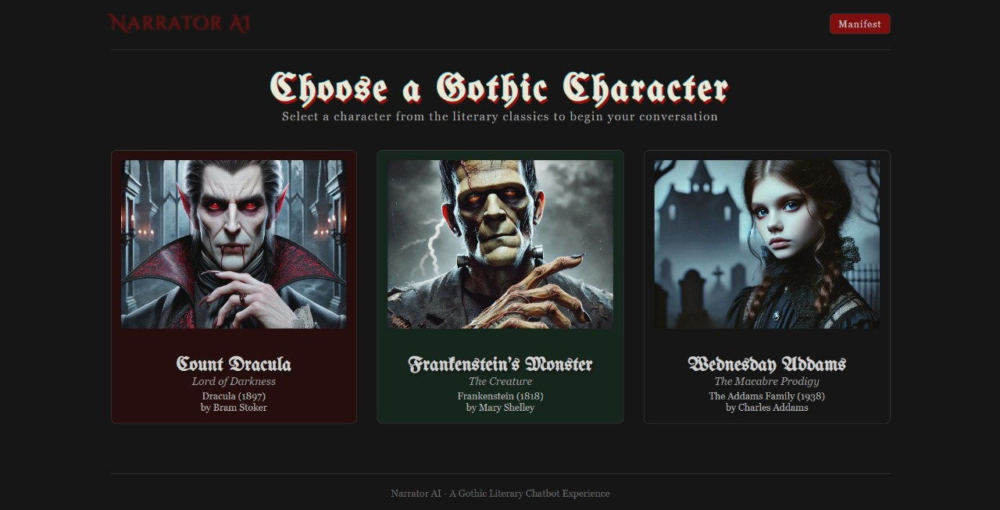

# Narrator AI


A gothic-themed chatbot where users can choose a character and chat with them. The app supports multiple AI models including OpenAI, DeepSeek, Claude, and local models via Ollama.

## Setup
1. Ensure node.js is installed on your system for this to work 

2. Open git bash in the intended install folder and enter:
```git
git clone https://github.com/nithingm/narrator-ai.git
```

3. Go to backend folder ( cd .\backend\ ) and enter:
```bash
npm install
npm run dev
```
   Backend should be running on http://localhost:5000

4. Open another terminal to go to frontend folder ( cd .\frontend\ ) and enter:
```bash
npm install
npm run dev
```
   Frontend should be running on http://localhost:3000

5. Install ollama for local models. For example, you can install llama3.2:1b using:
```bash
ollama pull llama3.2:1b
```
6. Replace .env.example file contents with API keys in the project folder to use OpenAI/Claude/Deepseek.
   Important: Please rename the file '.env.example' to '.env' in your local machine.

7. Now close all terminals and make sure the frontend and backend are not running. You are now ready to play with the app.
   
## Quick Start

Run the application using the start script:
1. On the terminal, go to the project folder.

On Linux/Mac:
```bash
./start.sh
```
On Windows:
```bash
start start.bat
```

- This should start both, the backend server and the frontend development server.

2. On browser, go to http://localhost:3000 to use the app

## Running Manually

### Backend

```bash
cd backend
npm run dev  # Development with auto-reload
# or
npm start    # Production
```

### Frontend

```bash
cd frontend
npm run dev
```

- Backend runs on: http://localhost:5000
- Frontend runs on: http://localhost:3000
  
## Features

- Gothic-themed user interface with customized styling
- Character selection from classic literature (Dracula, Frankenstein, Wednesday)
- Multi-model support (OpenAI, Claude, DeepSeek, Ollama local models)
- User authentication system*
- Persistent conversation memory per character*
- Local-first approach to minimize cloud costs

*\*feature in progress*
 
## Demo Mode

The application runs in demo mode by default:
- Mock API responses for characters that don't need external AI APIs
- Simulated login/authentication
- Fallback to demo characters if API fails

## Tech Stack

- **Frontend**: React with Next.js
- **Backend**: Express.js
- **Authentication**: JWT-based*
- **AI Integrations**: OpenAI, Claude, DeepSeek, Ollama

## Demo Login

You can log in with any credentials in demo mode - no actual authentication is performed.

## License

MIT
